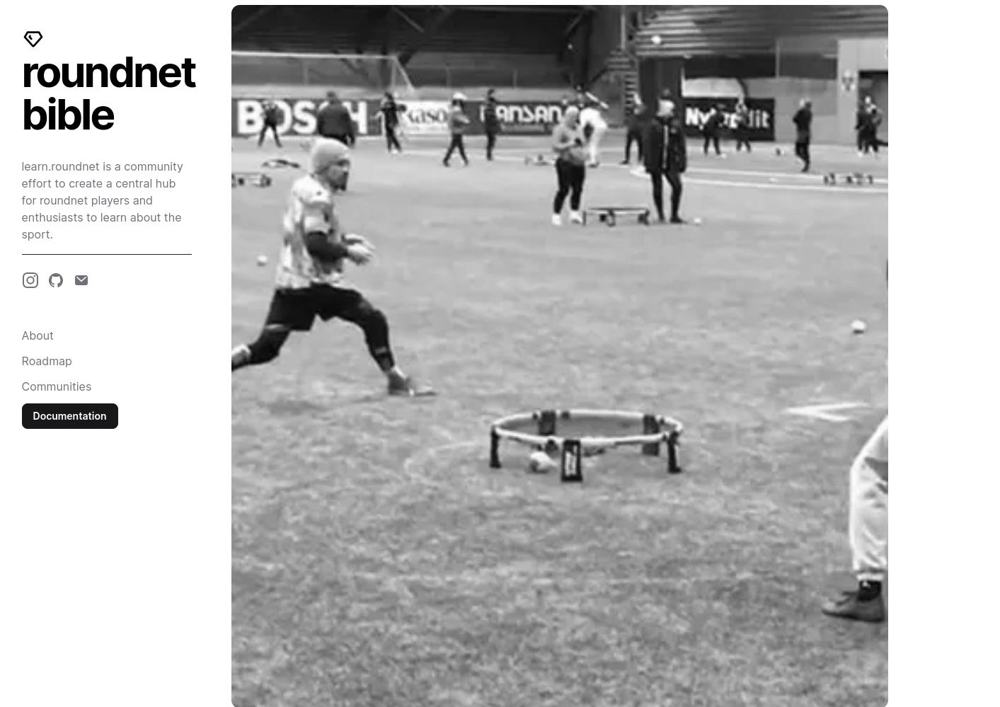

# Learn Roundnet

This is a website for the Learn Roundnet project. It is built with Nextra.

## Contributing

Go to the folder pages and add a new file with the name of the page you want to create. The file should be a markdown file. You can use the other files in the folder as a template.

[**Live Website →**](https://vercel.com/aaen/learn-roundnet-site)

## Local Development

First, run `pnpm i` to install the dependencies.

Then, run `pnpm dev` to start the development server and visit localhost:3000.

## License

This project is licensed under the MIT License.
